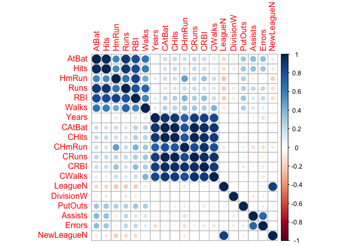
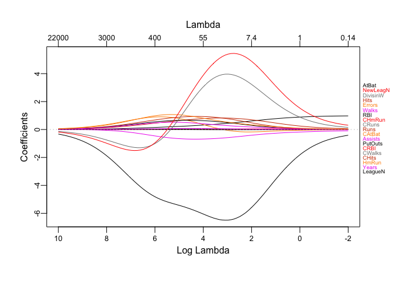
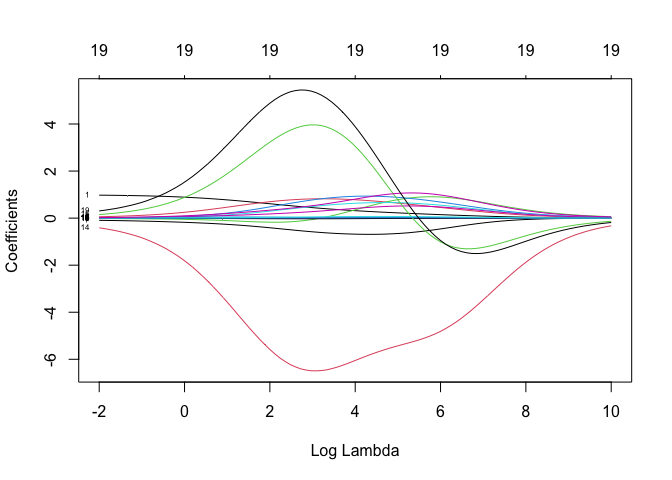
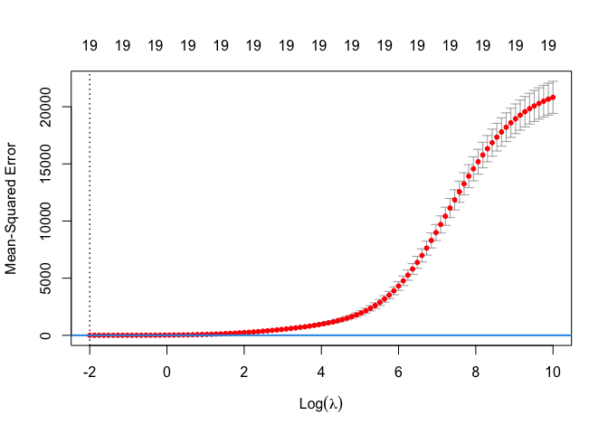

Ridge Regression and Lasso
================
Lin Yang

``` r
library(ISLR) #only for data
library(glmnet) #for regularized regression, can do all three models
library(caret)
library(corrplot)
library(plotmo)#plotmodel, generate trace plot
```

Predict a baseball player’s salary on the basis of various statistics
associated with performance in the previous year. Use `?Hitters` for
more details.

``` r
data(Hitters)
Hitters <- na.omit(Hitters)
Hitters2 <- model.matrix(Salary ~ ., Hitters)[ ,-1]

set.seed(1)
trainRows <- createDataPartition(y = Hitters$Salary,
                                 p = 0.8,
                                 list = FALSE)

x <- Hitters2[trainRows,]
y <- Hitters[trainRows]

corrplot(cor(x), method = "circle", type = "full")
```

<!-- -->

## Ridge

``` r
ridge_mod <- glmnet(x = x, y = y,
                    standardize = TRUE,
                    alpha = 0,
                    lambda = exp(seq(10, -2, length = 100)))

mat.coef <- coef(ridge_mod)
dim(mat.coef)
```

    ## [1]  20 100

### Trace Plot

``` r
plot_glmnet(ridge_mod, xvar = "rlambda", label = 19)
```

<!-- -->

``` r
plot(ridge_mod, xvar = "lambda", label = TRUE)
```

<!-- -->

### Cross-validation

``` r
set.seed(2)
cv.ridge <- cv.glmnet(x, as.numeric(y),
                      type.measure = "mse",
                      alpha = 0,
                      lambda = exp(seq(10, -2, length = 100)))
plot(cv.ridge)
abline(h = (cv.ridge$cvm + cv.ridge$cvsd)[which.min(cv.ridge$cvm)], col = 4, lwd = 2)
```

<!-- -->

``` r
cv.ridge$lambda.min
```

    ## [1] 0.1353353

``` r
cv.ridge$lambda.1se
```

    ## [1] 0.1353353

### Coefficients of the final model

``` r
predict(cv.ridge, s = cv.ridge$lambda.min, type = "coefficients")
```

    ## 20 x 1 sparse Matrix of class "dgCMatrix"
    ##                        s1
    ## (Intercept)  1.3609765489
    ## AtBat        0.9757825705
    ## Hits         0.0593840556
    ## HmRun       -0.0174066364
    ## Runs         0.0032785733
    ## RBI          0.0145526822
    ## Walks        0.0201051861
    ## Years       -0.0944086188
    ## CAtBat       0.0019597355
    ## CHits       -0.0059610480
    ## CHmRun       0.0079883201
    ## CRuns        0.0043059028
    ## CRBI        -0.0034328247
    ## CWalks      -0.0045259933
    ## LeagueN     -0.4119378597
    ## DivisionW    0.1518557878
    ## PutOuts      0.0004487204
    ## Assists      0.0009432443
    ## Errors       0.0216249576
    ## NewLeagueN   0.3063433381

``` r
head(predict(cv.ridge, newx = Hitters2[-trainRows,],
             s = "lambda.min", type = "response"))
```

    ##                   lambda.min
    ## -Alfredo Griffin    594.9704
    ## -Argenis Salazar    297.7813
    ## -Andres Thomas      322.7506
    ## -Alex Trevino       202.6550
    ## -Buddy Biancalana   190.5868
    ## -Bill Doran         550.2694
